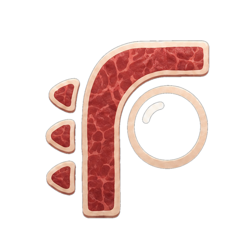

<p align="center">
  
</p>

# Rawr

An Android RAW camera with GPU image processing, film simulation, JPEG/DNG
capture, video recording, and a DNG renderer.

Requires RAW camera access and compatible Vulkan
hardware. Camera routing and RAW sizes still contain device-specific assumptions;
general device compatibility is not yet established.

## Build

Use JDK 17, an Android SDK, and `uv` on macOS or Linux. Install the pinned components:

```sh
sdkmanager 'platforms;android-36' 'build-tools;36.0.0' 'ndk;29.0.14206865' 'cmake;3.31.6'
export ANDROID_HOME=/path/to/android-sdk
./gradlew :app:assembleDebug
```

Debug APK: `app/build/outputs/apk/debug/app-debug.apk`.
Install explicitly with `adb install -r <apk>`. The debug application ID is
`com.rawr.camera.debug`; release uses `com.rawr.camera`.

See [build and signing](docs/build.md), [native architecture](app/src/main/cpp/ARCHITECTURE.md),
and [native modules](native/README.md).

## Checks

```sh
./gradlew :app:testDebugUnitTest :app:testReleaseUnitTest :app:lintDebug :app:lintRelease
cmake -S tests -B tmp/host-tests -G Ninja -DCMAKE_BUILD_TYPE=Debug
cmake --build tmp/host-tests --parallel 4
ctest --test-dir tmp/host-tests --output-on-failure
uv run --no-project tools/release/repository_hygiene.py
```

See [host tests](tests/README.md) for dependencies and sanitizers, and
[offline replay](docs/replay.md) for the retained MoltenVK tools and limitations.
Use `tmp/` for local evidence and `uv` for Python packages.

## License

See [LICENSE](LICENSE), [NOTICE](NOTICE), and [third-party notices](THIRD_PARTY_NOTICES.md).
