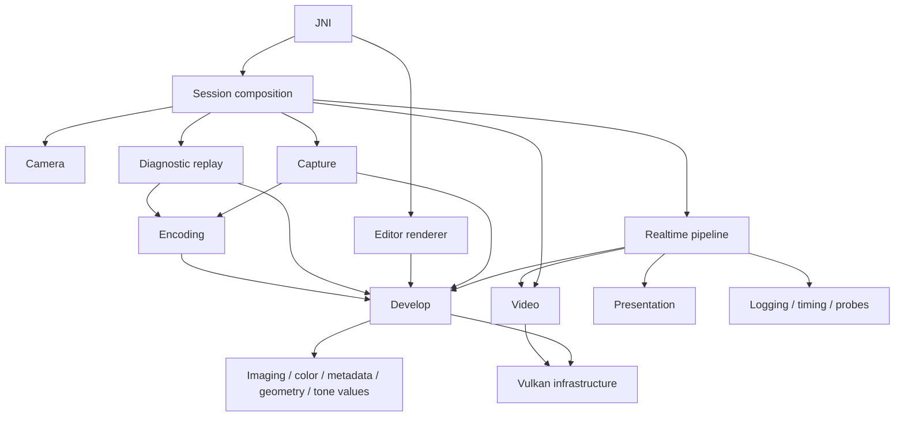

# Native app architecture

`app/src/main/cpp` adapts the imaging backends in `native/` to Android camera,
Vulkan, capture storage, video surfaces, and JNI. Each resource has an owning
component; coordination happens in `session/`. Imaging algorithms remain in
the backend libraries.

## Structure and responsibilities

The tree below shows the main boundaries and their principal files. Existing
camera controls, metadata helpers, algorithms, writers, and shaders remain
beside the component that uses them.

```text
cpp/
├── CMakeLists.txt
├── cmake/NativeModules.cmake          # Build ownership and allowed dependencies
├── jni/
│   ├── NativeEngineJni.cpp            # Live camera/capture JNI marshalling
│   ├── RendererJni.cpp                # Editor/recovery JNI marshalling
│   ├── SessionEngineApi.{h,cpp}       # Session API forwarding
│   ├── DevelopSettingsReader.{h,cpp}  # Shared settings decoding and defaults
│   └── JsonObject.h                   # JNI JSON object access
├── session/
│   ├── SessionEngine.{h,cpp}          # Composition, transitions, ingress dispatch, shutdown
│   ├── SessionSurfaces.cpp           # Coordinate presentation and RAW reader transitions
│   ├── SessionFrameCallbacks.{h,cpp}  # Adapt frame ports to session/capture owners
│   ├── SessionStillCapture.cpp        # Coordinate shutter, camera leases, and recovery
│   ├── SessionToneControls.cpp        # Coordinate look changes and video LUT updates
│   ├── SessionExposureControls.cpp
│   ├── SessionWhiteBalanceControls.cpp
│   ├── SessionMonitoringControls.cpp
│   ├── SessionDiagnostics.cpp
│   └── SessionHighlightReplay.cpp     # Prepare the session for diagnostic replay
├── camera/
│   ├── CameraControlSurface.{h,cpp}   # Camera policy and application control surface
│   ├── NativeCameraController.{h,cpp} # Public control intent, mutex, lifecycle sequencing
│   ├── CameraDeviceSession.{h,cpp}    # Private NDK handles, startup/rollback/retirement
│   ├── CameraCallbacks.{h,cpp}        # Revocable generation-tagged callback routing
│   ├── CameraRequestPipeline.{h,cpp}  # Request application/submission and provenance
│   ├── CameraResultProcessor.{h,cpp}  # Metadata/control decoding and follow-up actions
│   ├── CameraCallbackLifetime.h      # Callback admission, revocation, and drain guard
│   ├── CameraSessionPolicy.h
│   ├── CameraCadencePolicy.h
│   ├── TapFocusPolicy.h
│   ├── Camera*Controls/Capabilities/Result* files
│   └── vivo/                         # Vendor-specific Camera2 tags
├── imaging/
│   ├── FrameLimits.h                 # Shared reader/queue/pairer/slot capacity budget
│   ├── RawFrameIngress.{h,cpp}        # AImageReader acquisition
│   ├── RawFrameLease.h                # Move-only AImage and acquire-fence ownership
│   ├── FrameIngressQueue.{h,cpp}      # Bounded image/metadata queue and consuming worker
│   ├── FramePairer.{h,cpp}            # Timestamp pairing and eviction
│   ├── RawSnapshot.h                 # Frozen RAW + metadata + color value contract
│   └── Raw16CpuSnapshot.{h,cpp}       # Copy an acquired RAW into CPU storage
├── pipeline/
│   ├── RealtimePipeline.{h,cpp}       # Preview GPU resources and configuration
│   ├── RealtimeResources.h            # Borrowed importer/preview/recorder view
│   ├── FrameSubmitCoordinator.{h,cpp} # Pair, record, submit, and retire frame slots
│   ├── FrameSlotPool.{h,cpp}          # Slot images, commands, fences, and leases
│   ├── FrameLifecyclePort.h           # Transition and session notifications
│   ├── FrameCapturePort.h             # Capture handoff and ring recording contract
│   ├── FrameDiagnosticsPort.h         # Completed-frame diagnostic feedback
│   ├── RawDevelopRecorder.{h,cpp}     # Record RAW development and tone commands
│   ├── MonitorRecorder.{h,cpp}         # Record scopes, overlays, and presentation
│   └── PreviewLookController.{h,cpp}  # Tone/film resources, look state, and build worker
├── capture/
│   ├── CaptureCoordinator.h           # Own single/multiframe capture, admission, completion routing
│   ├── CaptureRequest.h               # Develop intent + output encoding request
│   ├── single/
│   │   ├── SingleFrameCoordinator.{h,cpp} # FIFO admission and job progression
│   │   ├── SingleFrameCaptureJob.{h,cpp} # One frame's capture/develop/output sequencing
│   │   ├── SingleFrameCaptureAcquisition.{h,cpp} # Frame claim, RAW-copy worker and handoff
│   │   ├── SingleFrameCaptureJournal.{h,cpp} # Frozen intent, durable commit/reload, reservation
│   │   ├── SingleFrameCaptureDevelop.{h,cpp} # Demosaic/render and pixel lifetime
│   │   ├── SingleFrameCaptureOutputs.{h,cpp} # Destinations, DNG/JPEG writers and outcomes
│   │   ├── SingleFrameCaptureContextBuilder.{h,cpp} # Value projection
│   │   ├── SingleFrameCaptureTypes.h
│   │   ├── SingleCaptureResult.h
│   │   └── SingleShotSlot.{h,cpp}      # One-frame acquisition intent
│   ├── multiframe/
│   │   ├── MultiframeCaptureCoordinator.{h,cpp} # Ring and frozen-work lifecycle
│   │   ├── MultiframeFrameRing.{h,cpp} # Metadata/color adapter over native ZSL ring
│   │   ├── FrozenBurst.h              # Pinned burst contract
│   │   ├── RzslCaptureWriter.{h,cpp}   # Post-shutter compressed RAW bundle output
│   │   ├── MultiframeWorkItem/Description/Tuning/QueueHelpers files
│   │   ├── mfsr/
│   │   │   ├── MfsrCaptureService.{h,cpp} # Background job lifecycle and completions
│   │   │   ├── MfsrCaptureJob.{h,cpp}  # Frozen-burst develop/output workflow
│   │   │   └── MergeProcessor.{h,cpp}  # Alignment, merge, and non-reference pin release
│   │   └── burst/                     # Existing future-mode stub; not compiled
│   └── persistence/                   # Schemas/storage/recovery and typed CaptureReservation
├── develop/
│   ├── DevelopSettings.h              # Development intent independent of encoding
│   ├── DevelopContextBuilder.{h,cpp}  # Shared projection into render context
│   ├── SharedHighlightRuntime.{h,cpp}
│   ├── HotPixelConceal.{h,cpp}
│   ├── demosaic/                      # RCD/VNG4/Dual adapters and single-flight worker
│   ├── render/
│   │   ├── RenderedStillTypes.h        # Context and completion contracts
│   │   ├── StillImageRenderer.{h,cpp} # Async worker and completion facade
│   │   ├── RenderResources.{h,cpp}    # Private image/buffer/engine/asset ownership and keys
│   │   ├── RenderDeviceContext.h      # Immutable binding and borrowed image/pixel views
│   │   ├── RenderCommandSession.{h,cpp} # Commands, fence, queries and chunk execution
│   │   ├── StillRenderSequence.{h,cpp} # Ordered synchronous stage execution
│   │   ├── FilmRenderStage.{h,cpp}    # Film/tone recording and typed fallback outcome
│   │   └── RenderReadback.{h,cpp}     # GPU download, timing/checksum/stats/diagnostics
│   ├── highlight/                     # Highlight contracts and snapshots
│   └── galosh/                        # Denoiser shader adapter
├── encoding/
│   ├── dng/                           # DNG writer and TinyDNG adapter
│   ├── jpeg/                          # JPEG output options, writer, EXIF
│   └── rzsl/                          # Streaming RAW bundle sink
├── video/
│   ├── VideoSession.{h,cpp}           # Settings, prewarm worker, and recording lifecycle
│   ├── VideoOutput.{h,cpp}            # Encoder surface/swapchain/images/semaphores
│   ├── VideoProcessingResources.{h,cpp} # Cached processing images and engines
│   ├── VideoRecorder.{h,cpp}          # Record video processing commands
│   ├── NativeAvRecorder.{h,cpp}       # Android codec/muxer integration
│   └── Mp4MetadataPatcher.{h,cpp}
├── presentation/
│   ├── PresentationSurface.{h,cpp}    # Android window and Vulkan surface ownership
│   ├── SwapchainRenderer.{h,cpp}      # Display swapchain and frame sources
│   ├── PresentRecorder.{h,cpp}        # Display draw commands
│   └── shaders/
├── renderer/                         # Editor source/render/surface orchestration
├── diagnostics/
│   ├── logging/                      # Logs, runtime trace, and frame audit
│   ├── timing/                       # GPU query ownership and timing snapshots
│   ├── probes/                       # RAW integrity/import/copy parity checks + shaders
│   └── replay/                       # Frozen highlight replay and readback + shaders
├── vulkan/
│   ├── VulkanContext.{h,cpp}         # Instance/device and actual-queue ownership
│   ├── QueueSubmission.h             # Submission authority and mutex per actual VkQueue
│   ├── CommandResources.{h,cpp}      # Move-only command pool/buffer ownership
│   ├── RawAhbImporter.{h,cpp}         # AHB import/cache; takes capability options
│   ├── RawImportOptions.h
│   ├── Synchronization.{h,cpp}
│   ├── VulkanDispatch.{h,cpp}
│   ├── HostMemory.h                  # Shared coherent host-memory type selection
│   ├── ImageResources.h
│   └── shaders/
├── support/UniqueFd.h                 # Move-only descriptor ownership
├── color/                            # Color transforms, WB, AE post-gain, UltraHDR values
├── geometry/                         # CFA, orientation, display/sensor mapping
├── metadata/                         # Camera/frame values, reading, validation
├── tonemap/                          # Profile and LUT integration, film field contract
└── monitoring/                       # Scope/overlay owners and settings
```

## Dependency direction

`cmake/NativeModules.cmake` is the authoritative list of module dependencies.
The build defines a target for each module and links the JNI shared library
from those targets. The current graph has 22 modules, including JNI and the
four diagnostic modules.



This diagram summarizes the main direction; the CMake manifest contains every
allowed edge. The pipeline has no concrete capture or session dependency.
Its three ports are implemented by `SessionFrameCallbacks`; passing that
adapter into a lower module does not give the module access to `SessionEngine`.
Capture, development, encoding, camera, video, and diagnostics do not reference
session implementations.

## Ownership and concurrency

- `SessionEngine` owns the transition mutex and Vulkan context. Its control
  translation units coordinate owners; they do not own a second copy of
  their resources. The former `CameraSession` aggregate has been removed.
- Camera callbacks enqueue move-only RAW leases or copied metadata. The
  ingress worker consumes events under the session transition mutex; the
  pairing/submission coordinator owns per-frame progression. Queue eviction,
  rejection, and destruction release image leases and acquire fences once.
- `FrameLimits.h` is the capacity source for six reader images, three GPU
  slots, one queued ingress image, and one paired image, with a compile-time
  budget check. Metadata capacities are eight ingress and three paired items.
- `RealtimePipeline` owns importer, preview, recorder, slot pool, and timing.
  `RealtimeResources` exposes borrowed pointers; frame submission cannot
  replace the owners' `unique_ptr` fields. `PreviewLookController` owns tone
  and film builds; `MonitorRecorder` owns only command-recording behavior.
- RAW ingress (`FrameSubmitCoordinator::ingestRaw`): RAW16 imports the camera
  AHB as an image (plus a storage buffer for buffer-direct reads). RAW10 imports
  the AHB as a storage buffer only, and `RawCpuUploadPool::gpuUnpack` hands out
  the pool's owned R16 slot image, which `acquireRawInputImage` fills with the
  `native/raw_ingress` unpacker. The camera fence then gates compute. If the
  import or the unpacker fails, the coordinator logs `RAW_INGRESS_FALLBACK` and
  latches to the CPU lock/unpack/upload (`RawCpuUploadPool::upload`).
  `debug.rawr.force_cpu_ingress 1` and the diagnostic modes keep the CPU route.
- `CaptureCoordinator` owns admission and the single/multiframe coordinators.
  Per-capture state is held in top-level jobs. The frozen RAW and burst
  contracts are separate from those coordinators. ZSL recording reserves an
  unready entry; successful queue submission commits it, retirement marks it
  ready, and failed submission discards it without consuming ring capacity.
- `VideoSession` owns the prewarm worker and settings. `VideoOutput` owns
  surface resources, `VideoProcessingResources` owns processing resources,
  and `VideoRecorder` records commands using those owners.
- `SingleFrameCaptureJob` coordinates independent DNG/JPEG outcomes through
  acquisition, journal, development, and output owners. Acquisition borrows a
  journal that outlives its worker. Frozen journal contexts contain no owning
  descriptors; output owners hold `UniqueFd` until the writer consumes it.
  The development owner retains mapped pixels until JPEG completion.
- `StillImageRenderer` owns the worker/completion facade. `RenderResources`
  owns private images, mapped buffers, engines/assets and per-engine keys;
  `RenderCommandSession` owns commands, fence and queries. The synchronous
  sequence preserves submission boundaries; readback consumes completed data.
  Engine persistence applies to pixel release; reset ends the resource lifetime.
- Camera helpers run under the controller's single state mutex. Callback guards
  separately protect admission/revocation and drain. The controller validates
  generation before reading request provenance; result processing returns actions.
  Preview/reader setup and cleanup run outside the camera mutex. Cleanup carries
  the retired reader generation, so it cannot destroy a newer reader.
- `VulkanContext` owns one `QueueSubmission` per actual queue. If multiframe
  work uses the primary queue, it shares the primary mutex. Backend adapters
  that still take a mutex borrow this same authority; some retain direct
  `vkQueueSubmit` calls within that lock. Command pools belong to their
  resource owner, not to the queue authority. Whole-device idle waits acquire
  the actual queues' submission locks through `VulkanContext::waitIdle()`.
- `CameraCallbackLifetime` gates callback admission and counts callbacks
  admitted before revocation. Device closure and request/output teardown
  retain the existing asynchronous Camera2 policy, including forced-orphan
  handling; handles live in `CameraDeviceSession`.

Shutdown first joins prewarm/look workers, shuts down camera callbacks, and
drains the ingress worker. It then stops video and releases cached video
processing, shuts down still work, waits for GPU work, and releases reader,
realtime/capture resources, swapchain, and surface before destroying Vulkan.
The capture owner and frame callback adapter outlive the frame coordinator.
Surface detach can remain deferred while independent still work is active.

## Shared contracts and compatibility

- `DevelopSettings` holds development intent. `JpegCaptureContext` holds
  encoding options, output descriptor, provenance, and EXIF. `CaptureRequest`
  combines them. Capture and editor JNI share decoding/default helpers;
  `DevelopContextBuilder` shares render-field projection while source geometry
  and noise preparation remain in their workflows.
- `RawSnapshot` and `FrozenBurst` carry acquired data across stages without
  depending on a session object. `UniqueFd`, `RawFrameLease`, and
  `CommandResources` express transfer of ownership.
- JNI entry points and payloads, durable journal versions and field order,
  demosaic enum representation, shader parameters, queue capacities, and the
  uncompiled burst stub are preserved. Shaders live beside their consumer;
  native imaging math was not changed by the extraction.
- Existing algorithm namespaces such as `develop::rendered` and
  `develop::demosaic::rcd` remain while the directory tree is shallower.

## Validation

See [host behavior tests](../../../../tests/README.md) for ownership, persistence,
and image-format regression checks. Module dependencies are declared in CMake.
